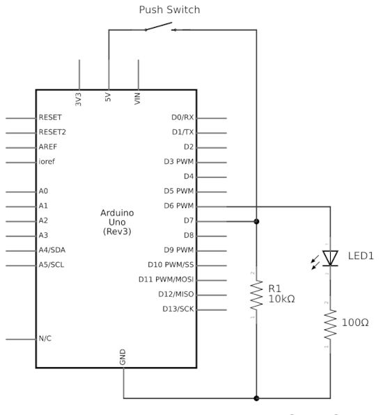
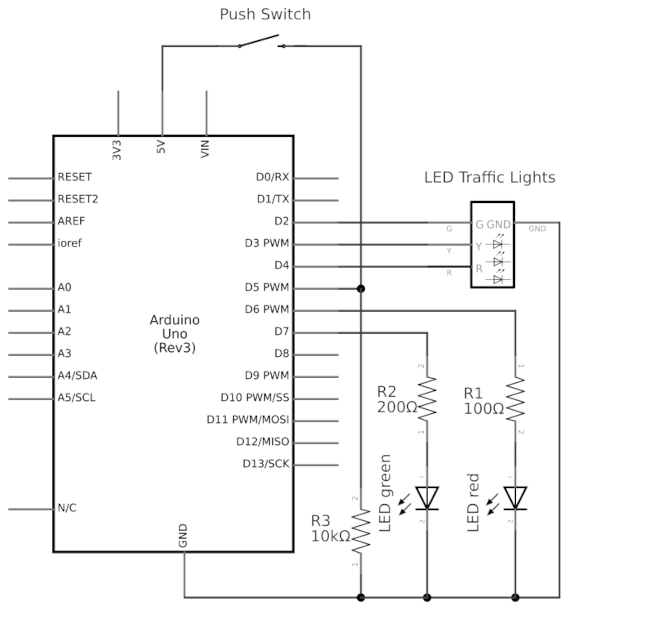

# Arduino Things

## The Arduino Sketches in Action ....

### 1. Two LEDs blinking one after the other...

[`two_leds_blinking.cpp`](./lib/two_leds_blinking/two_leds_blinking.cpp)

https://user-images.githubusercontent.com/58146347/224008390-d410d4f7-61e1-4469-b677-bebec6096557.mp4

- Arduino UNO R3 compatible device
- 2 blue LED
- 2 resistors 100 Ohm
******************

### 2. Let two LEDS pulsate one after the other

[`two_leds_pulsating.cpp`](./lib/two_leds_pulsating/two_leds_pulsating.cpp)

- layout and schematic are the same as in sketch #1

### 3. Turn on a LED by a button push and keep it shining

[`push_button_turn_on_led.cpp`](./lib/push_button_turn_on_led/push_button_turn_on_led.cpp)

https://user-images.githubusercontent.com/58146347/224008684-c011a418-c804-481d-8195-bd8051c7ed53.mp4

- Arduino UNO R3 compatible device
- 1 push button
- 1 blue LED
- 1 resistor 10 kOhm (as pulldown for button)
- 1 resistor 100 Ohm
********************

### 4. Testing a piezospeaker

[`piezospeaker_test.cpp`](./lib/piezospeaker_test/piezospeaker_test.cpp)

### 5. Simulating traffic lights with a pedestrian crossing

[`traffic_lights_pedestrian_crossing.cpp`](./lib/traffic_lights_pedestrian_crossing/traffic_lights_pedestrian_crossing.cpp)

https://user-images.githubusercontent.com/58146347/224008592-a2aa11da-87ce-4d42-a504-e8d7fcecd001.mp4

- Arduino UNO R3 compatible device
- traffic lights module for MCU (like https://www.az-delivery.de/products/led-ampel-modul)
- 1 red LED
- 1 green LED
- 1 push button
- 1 resistor 100 Ohm (as series resistance green)
- 1 resistor 200 Ohm (as series resistance red)
- 1 resistor 10 kOhm (as pulldown for button)
********************

### 6. Testing a RGB-LED

[`rgb_led_test.cpp`](./lib/rgb_led_test/rgb_led_test.cpp)

https://user-images.githubusercontent.com/58146347/224008078-e120d88f-8394-4b54-8151-0d6c879775bb.mp4

- Arduino UNO R3 compatible device
- 1 RGB-LED (common cathode)
- 3 resistors 200 Ohm

